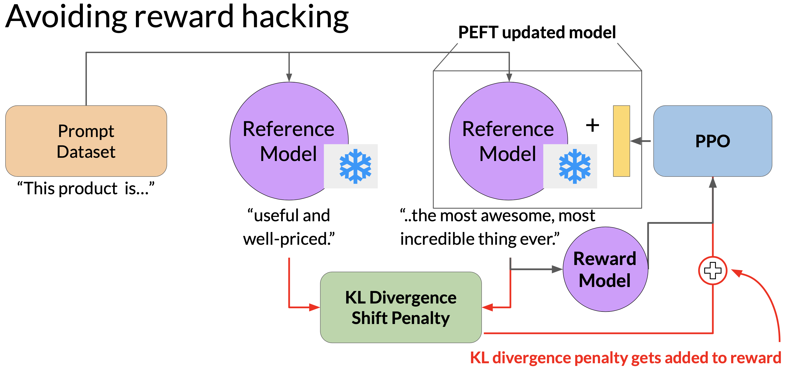

# Large Language Models

- [LLM Usage](https://github.com/kanru-wang/Large_Language_Models/tree/main#llm-usage)
- [Model Architectures and Pre-training Objectives](https://github.com/kanru-wang/Large_Language_Models/tree/main#model-architectures-and-pre-training-objectives)
- [GPU Memory Limit](https://github.com/kanru-wang/Large_Language_Models/tree/main#gpu-memory-limit)
- [Data Parallelism vs Model Sharding](https://github.com/kanru-wang/Large_Language_Models/tree/main#data-parallelism-vs-model-sharding)
  - [Distributed Data Parallel (DDP)](https://github.com/kanru-wang/Large_Language_Models/tree/main#distributed-data-parallel-ddp)
  - [Model Sharding](https://github.com/kanru-wang/Large_Language_Models/tree/main#model-sharding)
- [Optimal Model Size and Training Data Size Balance](https://github.com/kanru-wang/Large_Language_Models/tree/main#optimal-model-size-and-training-data-size-balance)
- [Pre-training LLMs](https://github.com/kanru-wang/Large_Language_Models/tree/main#pre-training-llms)
- [Fine-tuning (Instruction Fine-tuning)](https://github.com/kanru-wang/Large_Language_Models/tree/main#fine-tuning-instruction-fine-tuning)
- [Parameter Efficient Fine-Tuning (PEFT)](https://github.com/kanru-wang/Large_Language_Models/tree/main#parameter-efficient-fine-tuning-peft)
  - [Low-Rank Adaptation of Large Language Models (LoRA)](https://github.com/kanru-wang/Large_Language_Models/tree/main#low-rank-adaptation-of-large-language-models-lora)
  - [Prompt Tuning with Trainable Soft Prompts](https://github.com/kanru-wang/Large_Language_Models/tree/main#prompt-tuning-with-trainable-soft-prompts)
- [LLM Evaluation Metrics](https://github.com/kanru-wang/Large_Language_Models/tree/main#llm-evaluation-metrics)
- [Reinforcement Learning from Human Feedback (RLHF)](https://github.com/kanru-wang/Large_Language_Models/tree/main#reinforcement-learning-from-human-feedback-rlhf)
  - [Prepare labeled data for training](https://github.com/kanru-wang/Large_Language_Models/tree/main#prepare-labeled-data-for-training)
  - [Proximal policy optimization (PPO)](https://github.com/kanru-wang/Large_Language_Models/tree/main#proximal-policy-optimization-ppo)
  - [Reward Hacking](https://github.com/kanru-wang/Large_Language_Models/tree/main#reward-hacking)
  - [Direct Preference Optimization (DPO)](https://github.com/kanru-wang/Large_Language_Models/tree/main#direct-preference-optimization-dpo)
  - [Group Relative Policy Optimization (GRPO)](https://github.com/kanru-wang/Large_Language_Models/tree/main#group-relative-policy-optimization-grpo)
- [Constitutional AI](https://github.com/kanru-wang/Large_Language_Models/tree/main#constitutional-ai)
- [Retrieval-Augmented Generation](https://github.com/kanru-wang/Large_Language_Models/tree/main#retrieval-augmented-generation)

## LLM Usage

#### Providing examples inside the context window is called in-context learning

#### Chain-of-Thought Prompting (One Shot or Few Shot) can help LLMs reason

#### Program-Aided Language models (PAL) (One Shot)

The LLM doesn't really have to decide to run the Python code, it just has to write the script which the orchestrator then passes to the external Python interpreter to run.

#### ReAct Framework

- There is an API to query external data.
- The structure of the prompt: (1) Instructions, (2) ReAct example, (3) Question you want to ask.
- The completion contains multiple sets of Thought-Action-Observation trio.
  - Thoughts are what the LLM generates to reason about the current situation
  - The three allowed Actions (a limit imposed by the Instruction) are as follows. Notice that in the Instruction, the Action is formatted using square brackets so that the model will format its completions in the same way.
    - Search, which retrieves external data (a paragraph) about a particular topic
    - Lookup, which searches the next sentence containing the keyword in the current paragraph
    - Finish, which is the conclusion the model reaches
  - Observations are the new information gained from the external search and brought into the context.

## Model Architectures and Pre-training Objectives

#### Encoder-only

- Encoder-only models (a.k.a. Autoencoding models) (e.g. BERT and RoBERTa) are pre-trained using masked language modeling. 
- Tokens in the input sequence are randomly masked, and the training objective is to predict the masked tokens in order to reconstruct the original sentence. 
- The bi-directional representations of the input sequence allows the model to have an understanding of the full context of a token, and not just of the words that come before. 
- Encoder-only models are suited to tasks that benefit from bi-directional contexts. E.g. sentence classification or NER.

#### Decoder-only

- Decoder-only models (a.k.a. Autoregressive models) (e.g. GPT and BLOOM) are pre-trained using causal language modeling. 
- The training objective is to predict the next token based on the previous sequence of tokens. The model masks the input sequence, and can only see the input tokens leading up to the token in question. The model then iterates over the input sequence one by one to predict the following token. In contrast to the encoder architecture, this means that the context is unidirectional. 
- Decoder-only models are used for text generation, although large decoder-only models show strong zero-shot inference abilities, and can perform a range of tasks well.

#### Encoder-decoder

- Encoder-decoder models (a.k.a. Sequence-to-Sequence models) (e.g. T5 and BART) have pre-training objective that vary from model to model.
- For example, T5 pre-trains the encoder using span corruption, which masks random sequences of input tokens, and replaces them with a unique Sentinel token, shown here as x. Sentinel tokens are special tokens that do not correspond to any actual word. The decoder is then tasked with reconstructing the masked token sequences auto-regressively. The output is the Sentinel token followed by the predicted tokens.
- Use sequence-to-sequence models for translation, summarization, and question-answering. They are useful when you have a body of texts as both input and output.

## GPU Memory Limit

1B parameters takes about 4GB (32-bit full precision) GPU RAM. However to train a model with 1B parameters, need about 20 times the amount of GPU RAM that the model weights alone take up, i.e. 4 x 20 = 80GB.

#### Quantization: INT8

#### Quantization: FP16

#### Quantization: BFLOAT16

## Data Parallelism vs Model Sharding

(May be similar to https://leimao.github.io/blog/Data-Parallelism-vs-Model-Paralelism/)

### Distributed Data Parallel (DDP)

DDP requires that the model weights, and additional parameters, gradients, and optimizer states to be fit onto a single GPU. If they are too large, should use model sharding.

### Model Sharding

#### Zero Redundancy Optimizer (ZeRO)

- Reduces memory by distributing (sharding) the model parameters, gradients, and optimizer states across GPUs.
- There are 3 stages of ZeRO, each requires less memory.

#### Fully Sharded Data Parallel (FSDP)

- FSDP allows models that are too big to fit on a single chip.
- When using FSDP, distribute the data across multiple GPUs, but shard the model parameters, gradients, and optimizer states across the GPU nodes using one of the 3 ZeRO strategies.
- FSDP requires collecting model states (required for processing each batch) from all of the GPUs before the forward and backward pass. Each GPU requests data from the other GPUs on-demand, to materialize the sharded data into unsharded data for the duration of the operation. After the operation, release the unsharded non-local data back to the other GPUs as original sharded data. Can also choose to keep it for future operations, for example during backward pass, but this requires more GPU RAM again (a typical performance vs memory trade-off).
- In the final step after the backward pass, FSDP synchronizes the gradients across the GPUs in the same way they were for DDP.
- TensorFlow's Mirrored Strategy = PyTorch's Distributed Data Parallel
- FSDP lies between Data Parallelism and Model Parallelism: it retains the Data-Parallel paradigm (each GPU handles a slice of the batch and runs the same graph), but splits model state (model parameters, gradients, optimizer state) to reduce memory cost.
- In Model Parallelism, parts of the forward/backward computation run across devices for a microbatch. In FSDP, each GPU still executes the full forward/backward graph for its microbatch. Logically FSDP behaves like fully replicated model training. The parallelism is at Data-Parallel level, with sharding of state (model parameters, gradients, optimizer state) underlying it. FSDP = data-parallel + state-sharding
- In FSDP forward pass, before computing a layer, the required parameter shards may be gathered across all GPUs, so each GPU temporarily has access to the full parameter (just enough to compute). In backprop, again the parameter shards are gathered if needed (for computing gradients). Local gradients are computed; then gradient shards are summed across GPUs and redistributed such that each GPU ends up with only the gradient shard it needs.
- FSDP's optimizer state is sharded and the update is local.

## Optimal Model Size and Training Data Size Balance

- For a 70 billion parameter model, the ideal training dataset contains 1.4 trillion tokens (20 times the number of parameters).
- A compute optimal Chinchilla model outperforms non compute optimal models such as GPT-3 on a large range of downstream evaluation tasks.

 

## Pre-training LLMs

- (course on deeplearning.ai)
- Pre-training (or continual pre-training) is needed when the output need to be in a new language (programming language, Chinese).
- Need to clean data to avoid duplicated text or meaning, multi-language, typo, toxic words, privacy.
- Turn custom text files into HuggingFace dataset format, and combine it to a main HuggingFace pre-training dataset, as the new training data
- Concat all token input ids into a large list, and pack (reshape) tokens into the maximum sequence length to improve training efficiency. To avoid incoherence & “cross-document contamination”, (1) length-aware packing to reduce fragmentation, (2) packing semantically related documents together, (3) use overlapping windows when splitting.
- Downscaling is removing middle decoder layers to make a smaller model, and then start the pre-training.
- Depth upscaling: For example a model has 4 decoder layers, we create a larger model with layers [1, 2, 3, 2, 3, 4], and then start the pre-training.
- Often train one epoch only
- Evaluate by taking benchmark exams, which can be easily done with LLM evaluation harness packages.

 

## Fine-tuning (Instruction Fine-tuning)

- For LLM, fine-tuning means instruction fine tuning. Often, only 500-1000 examples are needed to fine-tune a single task.
- However, a fine-tuned model may forget how to do other tasks, called Catastrophic Forgetting. To deal with Catastrophic Forgetting, can either
  1. Ignore the problem because the use cases are limited
  2. Fine-tune on multiple tasks at the same time (may need 50,000 to 100,000 examples in the training set)
  3. Consider Parameter Efficient Fine-tuning (PEFT).
- A sample prompt training dataset (e.g. SAMsum) can be used to fine-tune (e.g. generate the FLAN-T5 from the pretrained T5. Here is a template for fine-tuning:

    

## Parameter Efficient Fine-Tuning (PEFT)

Benefits of PEFT
- Avoid catastrophic forgetting
- Only need to train small number of weights compared to the original LLM
- Only need to store different versions of PEFT weights at the size of MBs (instead of different versions of LLM at the size of GBs) for each task (e.g. QA, summarizing, completing...)

### Low-Rank Adaptation of Large Language Models (LoRA)

The optimum rank is in a range of 4 to 32.

LoRA can be done to the encoder and / or decoder part of the transformer. In this illustration, it shows an encoder, although LLMs are decoder-only.

Applying LoRA to just the self-attention layers is enough to fine-tune for a task and achieve performance gains. Can also use LoRA on other components like the feed-forward layers.

### Prompt Tuning with Trainable Soft Prompts

- A set of trainable tokens that are added to a prompt and whose values are updated during additional training to improve performance on specific tasks.
- Switch out Soft Prompt at inference time to change task.
- When the original LLM is large enough, Prompt Tuning can be as effective as full Fine-tuning.

## LLM Evaluation Metrics

A few examples Rouge-1 scores would fail:

- All words are present, but in a wrong order. Partially mitigated by Rouge-n
- “It is cold outside” and “It is not cold outside” are similar. Partially mitigated by Rouge-n
- “It is cold outside” and “Cold cold cold cold” would result in a Rouge-1 precision of 1.0. Mitigated by a clipping function that limits the number of unigram matches to the max count for that unigram within the reference sentence.
 
Can only use Rouge scores to compare the capabilities of models if the scores were determined for the same task. For example, summarization. Rouge scores for different tasks are not comparable to one another.

## Reinforcement Learning from Human Feedback (RLHF)

- The Reward Model is a regression model that indicates how good the sentence completion is, given a pair of (prompt, completion).
- The Reward Model is trained on triplets of (prompt, better completion, worse completion).
- The Policy is the LLM to be tuned.
- The State is prompt + tokens generated up until this point.
- The Action is generating tokens.
- Each time the LLM outputs a completion, its receives a Reward from the Reward model. The LLM weights are then updated via Proximal Policy Optimization.

The LLM weights are updated iteratively to maximize the Reward, enabling the model to generate non-toxic completions.

Use an additional model, known as the Reward Model, to classify the outputs of the LLM and evaluate the degree of alignment with human preferences. Specifically, start with a smaller number of human evaluated reward (pairwise comparison data) to train the Reward Model by traditional supervised learning methods (e.g. BERT). Once trained, use the Reward Model to assign a reward value (to the output of the LLM) which is used to update the weights of the LLM.

### Prepare labeled data for training

Convert rankings into pairwise training data for the reward model. While thumbs-up thumbs-down feedback is often easier to gather than ranking feedback, ranked feedback can generate more training data, i.e. three prompt completion pairs from each human ranking.

### Proximal policy optimization (PPO)

- Reinforcement learning algorithm takes the output of the Reward Model and uses it to update the LLM model weights so that the reward score increases over time.
- Phase 1: use LLM to complete the given prompts
- Phase 2: update LLM against the Reward Model
- The PPO objective updates the model weights through back propagation over several steps. Once the model weights are updated, PPO starts a new cycle. For the next iteration, the LLM is replaced with the updated LLM, and a new PPO cycle starts. After many iterations, the human-aligned LLM is obtained.

#### Value Function and Value Loss

- The expected reward of a completion is estimated through a separate head of the LLM called the value function.
- The value function estimates the expected total reward for a given State S. In other words, as the LLM generates each token of a completion, estimate the total future reward based on the current sequence of tokens.
- The goal is to minimize the value loss that is the difference between the actual future total reward (e.g. 1.87), and its approximation to the value function (e.g. 1.23). The value loss makes estimates for future rewards more accurate.
- The value function is then used in Advantage Estimation in Phase 2.

#### Policy Loss

- π(a_t | S_t) is the probability of the next token a_t given the current prompt S_t.
- π is the model’s probability distribution over tokens.
- The action a_t is the next token, and the state S_t is the completed prompt up to the token t.
- A-hat_t is the estimated advantage term of a given choice of action.
  - The advantage term estimates how much better or worse the current action (current token A_t) is compared to all possible actions (all the possible tokens) at that state.
  - We look at the expected future rewards of a completion following the new token, and we estimate how advantageous this completion is compared to the rest.
  - There is a recursive formula to estimate this quantity based on the value function.
  - A positive advantage means that the suggested token is better than the average. Therefore, increasing the probability of the current token seems like a good strategy that leads to higher rewards.
- The advantage estimates are valid only when the old and new policies are close to each other. These extra errors terms are guardrails defining a trust region in proximity to the LLM.

#### Entropy Loss

While the policy loss moves the model towards alignment goal, entropy allows the model to maintain creativity. If you kept the entropy low, the model may always complete the prompt in the same way.

### Reward Hacking

- Reward hacking is when the agent learns to cheat the system by favoring actions that maximize the reward received even if those actions don't align well with the original objective.
- In the context of LLMs, reward hacking can manifest as the addition of words or phrases to completions that result in high scores for the metric being aligned, but that reduce the overall quality of the language.
- For example, the completion “… is the most awesome, most incredible thing ever” is certainly non-toxic, but it is not useful.
- During training, each prompt is passed to both the reference LLM and the RL updated LLM.
- KL divergence is a statistical measure of how different two probability distributions are.
- Added KL divergence to the reward calculation, which penalizes the RL updated LLM if it shifts too far from the reference LLM (generating completions that are too different).
- Can use PEFT, which reuses the same underlying LLM for both the reference LLM and the RL updated LLM. The benefit is the reduced memory footprint.

### More on RL PPO (Sep 2025)
- First do SFT -> Train a Reward Model -> Further train LLM by RLHF
- SFT Pros: fast. SFT Cons: overfitting and hard to align with subtle human preferences.
- RLHF Pros: Align with humans. RLHF Cons: feedback collection, slow training, reward hacking
- Reward value updates the weights of the LLM (in the RL way), so that the reward score increases over time.
- LLM is the Policy model a.k.a. Actor; Value Function is the Critic.
- The Value Function estimates the total future reward based on the current sequence of tokens. This is needed in estimating Policy Loss's Advantage Term.
- The Value Loss is the difference between the actual future total reward and the Value Function's estimated total reward. When we minimize the Value Loss, the Value Function can estimate future rewards more accurately.
- The Advantage Term estimates how much better or worse the current action (token) is, compared to all possible actions (tokens) at that state.
- The Value Function is usually built on LLM's backbone, except its head produces a single scalar value for a given state. This scalar is the estimate of expected return from that state.
- The model first generates a full response sequence for each prompt, so we can have the full reward and then can compute full PPO loss. After a batch of prompts & responses, attribute the total sequence-level reward to each token, to compute policy loss and value loss per token.
- Usually a pairwise human preference dataset is prepared to train the reward model, although a pre-trained reward model can also be used.
- PPO training function takes (batch_of_query_tokens, batch_of_response_tokens, batch_of_reward_scalar_value_from_reward_model) triplets as input.
- When KL-divergence loss is added to prevent Reward Hacking, PPO Loss becomes [Policy Loss + Entropy Loss] + Value Loss + KL Loss

 

### Direct Preference Optimization (DPO)

- DPO trains the LLM to match the preference data (desired ordering), with a KL regularization.
- DPO does not require a reward model or a value function.
- DPO tries to maximize reward for the positive sample and minimize reward for the negative sample.
- If DPO is offline / off-policy, it would rely on a fixed preference dataset and does not actively generate new trajectories from the policy during training.
- Because DPO does not directly “see” where the policy might go (no exploration), DPO is less effective for tasks of complex reward.
- Curate DPO training data by (1) Generate reponses from the original model as negaive responses, and make corrections so that they are positive, or (2) Use the original model to generate multiple responses, and pick and best and worst reponses as positive and negative, based on human or reward functions.

 

### Group Relative Policy Optimization (GRPO)

- It does not have a Value Model. For a given prompt, the current LLM generates a group of candidate responses; a reward model assigns a reward to each response, and advantage is computed by comparing each response’s reward relative to the group mean - thus removing the need for a separately trained value function.
- If a particular response's reward is higher than the average reward, it will receive a positive advantage, and gradient pushes up its probability under the policy; vice Versa.
- The rest is the same as PPO.
- Because there is no Value Model, GRPO is usually more memory- and compute-efficient than PPO, but requires more samples than PPO.
- PPO uses an actual value model to assign credit for each token, so each token has a different advantage value. In GRPO, each token has the same advantage.

 

### Post-training of LLMs (course on deeplearning.ai)

- Pre-training usually needs 2T tokens. Continual pre-training needs at least 1B tokens (about 5000 domain books).
- SFT and DPO need at least 1k tokens. Online RF needs at least 1k prompt-response-reward triplets.
- RL can improve model capabilities without degrading performance in unseen tasks, while SFT may degrade. 
- Consider using a very good LLM to generate training data for SFT. The quality and diversity of the dataset is much more important than quantity.
- On-policy (online) RL collects freshly generated responses from the current LLM and their rewards. updates its weights, and explores new responses as it learns.
- Off-policy (offline) RL reuses previously collected prompt-response(-reward) tuples (triplets).
- Reward Function can be (1) Trained Reward Model, or (2) Verifiable Reward (math calculation and code unit testing).
- Direct vs indirect preference modeling — whether the algorithm directly optimizes a preference loss (e.g. pairwise comparisons) or uses a reward model and then applies RL to maximize expected reward.

 

## Constitutional AI

- In the first stage,
  1. Generate harmful responses, which is called Red Teaming.
  2. Ask the model to critique its own harmful responses according to the constitutional principles and revise them to comply with those rules.
  3. Fine-tune the model using the pairs of red team prompts and the revised constitutional responses. The goal is to create a fine-tuned LLM that has learned to generate constitutional responses.
- In the second stage,
  1. Is similar to RLHF, except that instead of human feedback, we now use feedback generated by a model. This is called RLAIF (Reinforcement Learning from AI Feedback).
  2. Use the fine-tuned model from the previous step to generate a set of responses to prompts. The result is a model generated preference (according to the constitutional principles) dataset for training a Reward Model.
  3. With the Reward Model, can now fine-tune the fine-tuned model further using a reinforcement learning algorithm like PPO.

 

## Retrieval-Augmented Generation

#### Pre-Retrieval

- From: https://python.langchain.com/docs/use_cases/query_analysis/
- Query Decomposition: If a user input contains multiple distinct questions, decompose the input into separate queries that will each be executed independently.
- Query Expansion: Use an LLM to suggest additional queries, for each query retrieve results from a vector DB and dedup, and send results to an LLM.
- Hypothetical Document Embedding (HyDE): This is one way of Query Expansion. Use an LLM to suggest a hypothetical answer, combine the query and the answer, retrieve results from a vector DB, and send results to an LLM.
- Query Routing: If we have multiple embedding sets and only a few are useful for a given user input, route the input to only retrieve results from the relevant embedding sets.
- Step Back Prompting: Sometimes search quality and model generations can be tripped up by the specifics of a question. Retrieve results from a vector DB, use an LLM to answer a pre-defined guiding question with a latent answer, and then use the LLM to generate the final answer.
- Query Structuring: If documents have multiple searchable/filterable attributes, we can infer from any raw user question which specific attributes should be searched/filtered over. For example, when a user input specific something about video publication date, that should become a filter on the publish_date attribute of each document.
- [Embedding Adaptor](train_RAG_query_embedding_adaptor_matrix.pdf)

#### Retrieval

- An evaluation library would have a feedback function that provides a score after viewing an LLM app's inputs, outputs, and intermediate results.
- Sentence-window retrieval (LlamaIndex)
	- Apart from the top k chunks, also include the context around the chunks.
	- Increase the window size may improve context relevance and therefore indirectly improve groundedness. Because when the retrieval step does not produce enough relevant context, the LLM in the completion step will tend to fill in those gaps by its pre-existing knowledge.
	- But when the window size is too large, even if the context relevance is high, there could be a drop in the groundedness because the LLM can get overwhelmed with contexts that are too large and fall back on its pre-existing knowledge.
- Auto-merging retrieval (LlamaIndex)
	- Auto-merging retrieval (1) Define a hierarchy of smaller chunks linking to bigger parent chunks. (2) During retrieval, if the set of smaller chunks linking to a parent chunk exceeds a threshold, then we retrieve the parent chunk instead to help ensure more coherent context. Otherwise, the ordering of small chunks can be wrong.
	- Need to embed leaf nodes, so we can lookup the top K embedding. The leaf nodes are embedded using the embedding model, and also indexed (vector store index) for auto-merging.
	- For Auto-merging retrieval, in order to reduce token usage, we re-rank after merging. For example, `retrieve top 12 -> merge -> top 10 -> merge -> top 6`.
- Maximal Marginal Relevance
	- Choose the `fetch_k` most similar responses from a vector DB
 	- But within those `fetch_k` responses choose the `k` most diverse responses for a more comprehensive final response
- Need to tune number of levels, children, and chunk size to find the best hierarchical structures for a certain doc type (e.g. contracts, invoices)

#### Post-Retrieval

- Reranking: Following the bi-encoding and the top-k retrieval with vector similarity comparison, we need to re-rank (to calculate the query-chunk relevance). A cross-encoder can be used to re-rank. Each query-chunk pair is concatenated and passed to a cross-encoder for scoring its relevance. A cross-encoder model (e.g. BERT) is first fine-tuned by many such pairs. Can also use LLM itself to re-rank.

